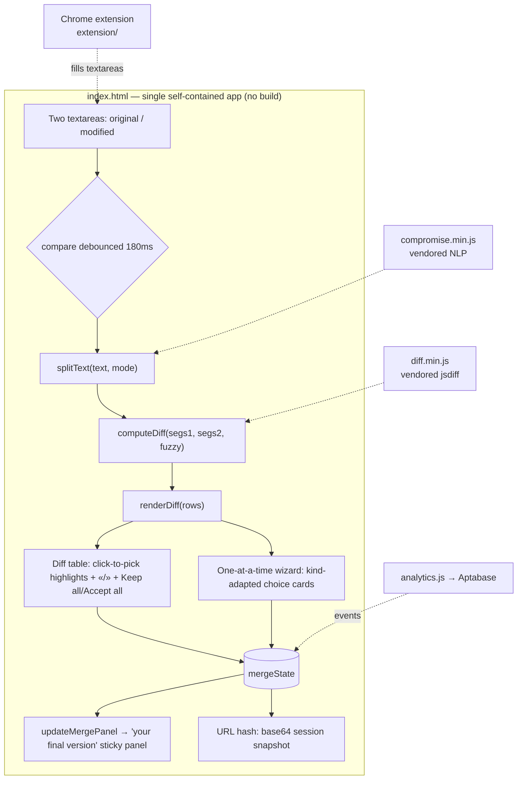

# Overview — differ as built

> Inferred by /adopt from the codebase — verify. Present-state summary of the app
> as it exists today: data model, architecture, and the main user stories. Future
> plans → `docs/ROADMAP.md`; history → `docs/JOURNAL.md`; engineering contract →
> `docs/architecture.md`.

**differ** is a browser-based text review and merge tool at
[differapp.com](https://differapp.com). Paste two versions of any text, see
exactly what changed at the sentence / paragraph / clause / line level with word-
or character-level highlighting, then interactively build and copy or share a
merged result. Everything runs in the browser — text never leaves the device.
Also shipped as a Chrome extension for capturing text from any page.

## Architecture (as built)



The whole application is `index.html` (markup + CSS + inline JS) with two vendored
dependencies (`compromise.min.js`, `diff.min.js`) so it runs fully offline. The
Chrome extension in `extension/` captures text elsewhere and fills the app's
textareas; it's independent of the app's internals.

## Data model (as built)

```mermaid
classDiagram
  class Segment {
    +string text
    +string pre  // original leading whitespace
  }
  class Row {
    +int segIdx        // merge-state key
    +parts[]           // {value, added, removed} from jsdiff
    +int chunkCount
    +kind              // changed | removed | added
  }
  class MergeState {
    +map segIdx to chunkMap
  }
  class ChunkDecision {
    +value  // 'left' | 'right' | null(unresolved) | custom
  }
  class SavedMergeStates {
    +map mode to (mergeState, undoStack)  // per split mode
  }
  Row "1" --> "many" Segment : from
  MergeState "1" --> "many" ChunkDecision : segIdx.chunkIdx
  SavedMergeStates "1" --> "many" MergeState : per mode
```

`mergeState[segIdx][chunkIdx]` holds each chunk's decision (`'left'`, `'right'`,
`null`, or a custom edit). The undo stack records single / batch-row / batch-all
steps. Merge decisions are saved per split mode and restored on switch; only a
text edit clears them. The full session (texts, mode, toggles, mergeState)
serializes to the URL hash for sharing.

## Main user stories (as implemented)

- **Compare two texts.** Paste original left, modified right; the diff updates
  live (no compare button). Pick a split mode — paragraph, sentence (default),
  clause, line — and optionally char-level highlighting, smart (fuzzy) matching,
  ignore case (on by default), ignore spacing. Show-changed-only by default.
- **Review side by side.** Two-column diff with click-to-pick highlights, «/» row
  accept, Keep all / Accept all pills per column, a sticky "your final version"
  panel, and an `N of M changes reviewed` progress bar. Each changed row offers a
  "review →" jump into the guided wizard.
- **Review one at a time.** A guided wizard: stepper dots colored by decision, a
  stage card showing the change in surrounding context, and kind-adapted choice
  cards (keep / use new / write my own for a replace; keep it / remove it / write
  my own for a delete; leave it out / add it / write my own for an insert) with a
  running final-version preview and a done screen. Switch between the two views
  losslessly.
- **Build and take the result.** The assembled text preserves the source's
  original spacing; undecided chunks render as `{old|new}` placeholders. Copy it
  from the toolbar's `copy result` pill, or click **share link** to copy a URL
  that reproduces the exact diff and every decision (up to a 32 KB payload).
- **Pick a look.** A theme dropdown offers editorial "reading" themes (paper /
  paper-dark, serif) and the original "code" monospace themes (auto/light/dark,
  nord, solarized dark, dracula, github); the choice persists.
- **Install / use offline.** Installable as a PWA (Add to Home Screen); works
  offline via the service worker.
- **Capture from any page (extension).** Select text on any web page → right-click
  → Set as Original / Set as Modified → differ opens with both loaded. On a Google
  Doc, "Compare suggestions in Differ" diffs the original against the document
  with all open suggestions accepted (parsed locally from the `.docx` export).

## Surfaces & hosting

- **Web app** — repo root, served verbatim by GitHub Pages (main / root, no CI);
  a push to `main` is a deploy. Custom domain differapp.com over HTTPS.
- **Chrome extension** — `extension/` (Manifest V3); Web Store listing assets in
  `extension/store/`, publishing steps in `extension/PUBLISHING.md`.
- **Analytics** — cookieless Cloudflare (aggregate) + Aptabase (custom events);
  see `ANALYTICS.md`.
